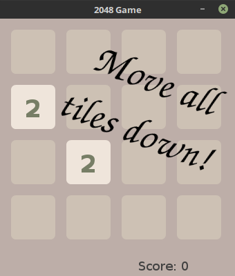
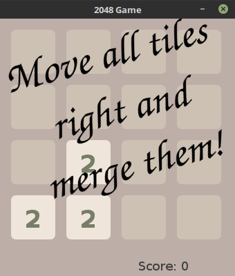
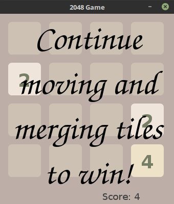

# Simple implementation of 2048 game, written in Java.
This is a simple java implementation of 2048 game.

## Running the game
Copy jar from `out/artifacts/Java_2048_jar/Java_2048.jar`
and place it where you want the game to be.

##### From Terminal
Open terminal in directory you have placed the jar in, then run `java -jar Java_2048.jar`  
If you placed the file in some other directory or renamed it, run `java -jar <path/to/file.jar>`,
replacing `<path/to/file.jar>` with path to your downloaded jar.

##### From GUI
Double-click the downloaded file.
If it does not start automatically, right-click it,select "Open with..." and select "java" from the menu.

## Playing the game

Use arrow keys to move the tiles. Using ESCAPE key you can reset the game at any time.  
Merge 2 tiles with the same values by moving one into the other!  
Can you get tile 2048? How much score can you get? What's the highest tile value you can get?

